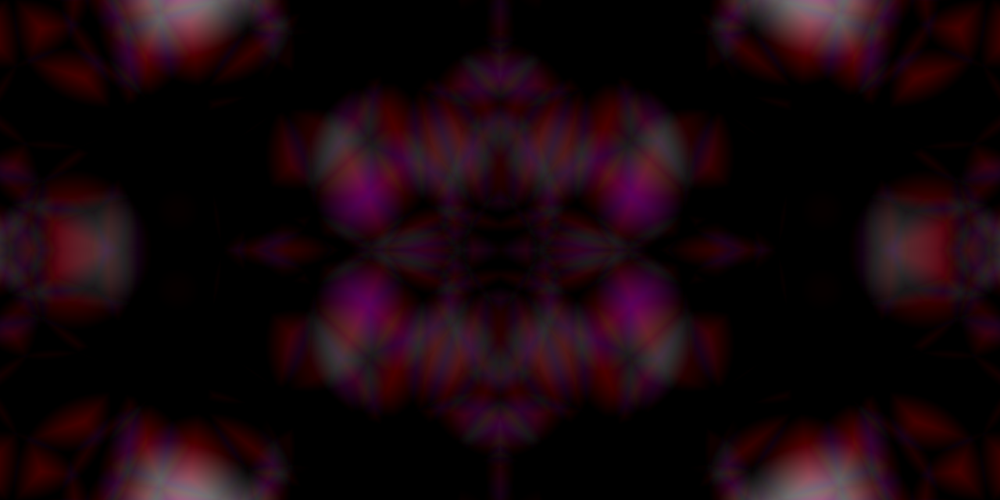

# CEV Generator 

This program simple recreates what psychedelic & hypnogogic [Level III CEVs](https://en.wikipedia.org/wiki/Closed-eye_hallucination) look like, either when listening to music or not. It mostly uses [Worley Noise](https://en.wikipedia.org/wiki/Worley_noise).

